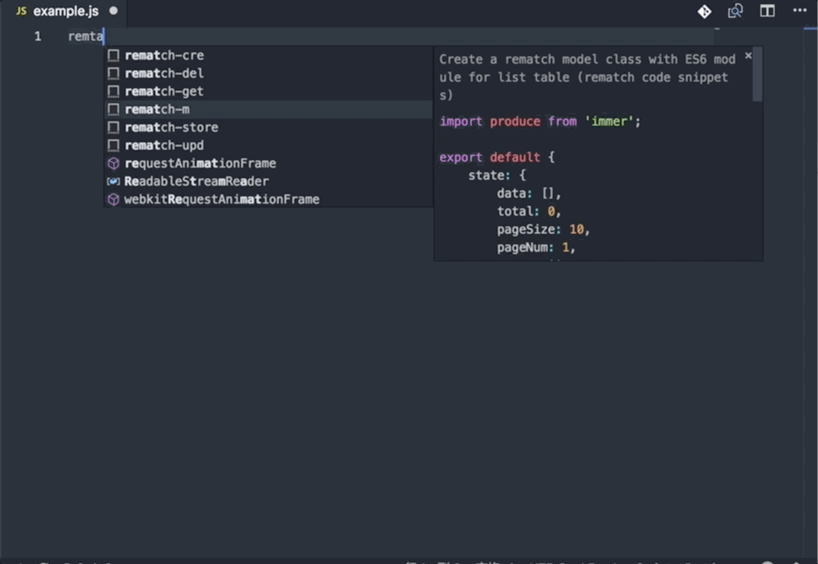

# Rematch-snippets

## VS Code Reactjs rematch snippets

---

## Installation

In order to install an extension you need to launch the Command Pallete (Ctrl + Shift + P or Cmd + Shift + P) and type Extensions.
There you have either the option to show the already installed snippets or install new ones.

## Supported languages (file extensions)

- JavaScript (.js)

## Usage

create a rematch store

Create a rematch model class with ES6 module for list table

## Snippets

|          Trigger | Content                                                     |
| ---------------: | ----------------------------------------------------------- |
| `rematch-store→` | Create a rematch store                                      |
|     `rematch-m→` | Create a rematch model class with ES6 module for list table |
|   `rematch-get→` | Rematch teffects get                                        |
|   `rematch-del→` | Rematch teffects delete                                     |
|   `rematch-cre→` | Rematch teffects create                                     |
|   `rematch-upd→` | Rematch teffects update                                     |

## Dependencies

- [react](https://facebook.github.io/react/)

- [rematch](https://github.com/rematch/rematch)
- [react-router-redux](https://github.com/reactjs/react-router-redux)
- [immer](https://github.com/mweststrate/immer)
