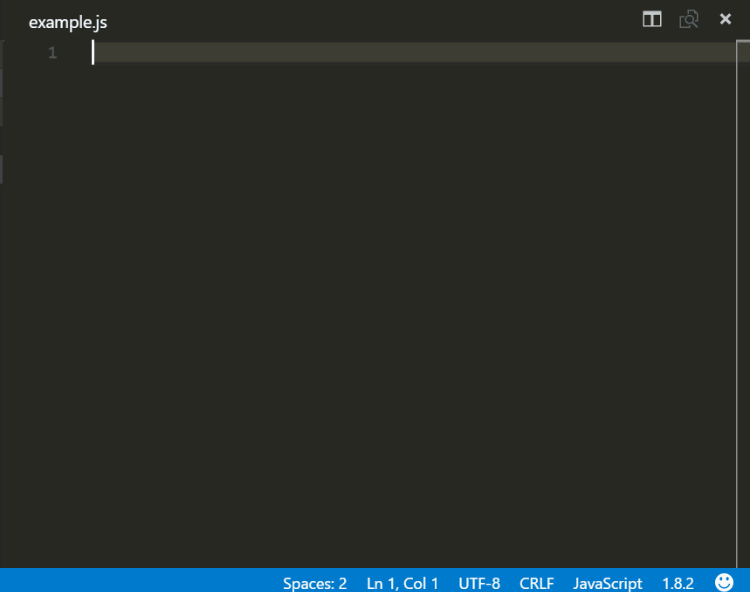

# Rematch-snippets

## VS Code Reactjs rematch snippets

---

## Installation

In order to install an extension you need to launch the Command Pallete (Ctrl + Shift + P or Cmd + Shift + P) and type Extensions.
There you have either the option to show the already installed snippets or install new ones.

## Supported languages (file extensions)

- JavaScript (.js)

## Usage

When installing the extension React development could be really fun

As VS Code from version 0.10.10 supports React components syntax inside js files the snippets are available for JavaScript language as well.
In the following example you can see the usage of a React stateless component with prop types snippets inside a js and not jsx file.

## Snippets

|          Trigger | Content                                                     |
| ---------------: | ----------------------------------------------------------- |
| `rematch-store→` | Create a rematch store                                      |
|     `rematch-m→` | Create a rematch model class with ES6 module for list table |
|   `rematch-get→` | Rematch teffects get                                        |
|   `rematch-del→` | Rematch teffects delete                                     |
|   `rematch-cre→` | Rematch teffects create                                     |
|   `rematch-upd→` | Rematch teffects update                                     |

[react]: https://facebook.github.io/react/
[babelsublime]: https://github.com/babel/babel-sublime-snippets
[javacript]: https://github.com/xabikos/vscode-javascript
